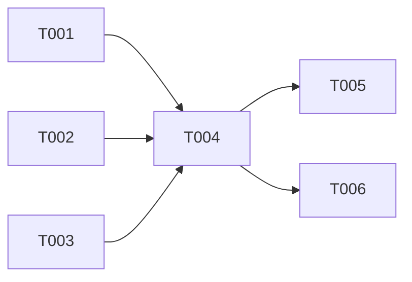

# Plan: Fix watched_states dispatch for Issue-type project items

> Track: fix-issue-dispatch-20260317
> Spec: [spec.md](./spec.md)

## Overview

- **Source**: /please:plan
- **Track**: fix-issue-dispatch-20260317
- **Issue**: #119
- **Created**: 2026-03-17
- **Approach**: Promote linked PR review_decision in normalizeProjectItem()

## Purpose

Fix `dispatchWatchedIssues()` so it dispatches agents for Issue-type project items in watched states. Currently, Issue-type items are silently skipped because their `review_decision` is always `null`.

## Context

The orchestrator's `dispatchWatchedIssues()` guard (`if (!issue.review_decision) continue`) blocks all Issue-type items. For Issues, `review_decision` is always `null` because the GraphQL `... on Issue` fragment doesn't include `reviewDecision` (only `... on PullRequest` does). However, linked PR review decisions are already available in `pull_requests[*].review_decision`, populated from `closedByPullRequestsReferences`.

## Architecture Decision

**Approach**: Promote linked PR `review_decision` to Issue-level in `normalizeProjectItem()` (Solution A from investigation).

**Rationale**: Fixes data at the source. All downstream logic (dispatch guard, `isWatchedUnchanged`, prompt templates, logging) works correctly without further changes. The `isWatchedUnchanged()` function already handles linked PR timestamp comparisons correctly.

**Alternative considered**: Widening the dispatch guard in `orchestrator.ts` — rejected because it would leave `issue.review_decision` as `null` in logs/templates and require changes to `isWatchedUnchanged` dedup logic.

## Tasks

<!-- Phase A: Tests (Red phase — write failing tests first) -->
- [x] T001 [P] Add test: normalizeProjectItem promotes review_decision from open linked PR (file: apps/work-please/src/tracker/tracker.test.ts) [TR-1]
- [x] T002 [P] Add test: normalizeProjectItem returns null for Issue with no linked PRs (file: apps/work-please/src/tracker/tracker.test.ts) [TR-2]
- [x] T003 [P] Add test: normalizeProjectItem ignores closed linked PRs when promoting (file: apps/work-please/src/tracker/tracker.test.ts) [TR-3]

<!-- Phase B: Fix (Green phase — make tests pass) -->
- [x] T004 Promote linked PR review_decision in normalizeProjectItem (file: apps/work-please/src/tracker/github.ts) (depends on T001, T002, T003) [FR-1, FR-2]

<!-- Phase C: Integration tests -->
- [x] T005 Add test: dispatchWatchedIssues dispatches Issue-type with promoted review_decision (file: apps/work-please/src/orchestrator.test.ts) (depends on T004) [TR-4]
- [x] T006 Add regression test: PR-type items retain direct reviewDecision unchanged (file: apps/work-please/src/tracker/tracker.test.ts) (depends on T004) [TR-5]

## Dependencies

## Key Files

| File | Lines | Role |
|------|-------|------|
| `apps/work-please/src/tracker/github.ts` | 415 | `normalizeProjectItem()` — fix location |
| `apps/work-please/src/orchestrator.ts` | 606 | `dispatchWatchedIssues()` guard — no change needed |
| `apps/work-please/src/types.ts` | 9-45 | `LinkedPR`, `Issue` types — no change needed |
| `apps/work-please/src/tracker/tracker.test.ts` | 1310+ | Review decision normalization tests |
| `apps/work-please/src/orchestrator.test.ts` | 833+ | Watched dispatch tests |

## Verification

1. Run `bun run test:app` — all tests pass
2. Run `bun run check:app` — no type errors
3. Run `bun run lint:app` — no lint errors
4. Verify new tests cover: promotion from open PR, null for no linked PRs, ignore closed PRs, dispatch integration

## Progress

- 2026-03-17: T001-T003 completed (Red phase — failing tests)
- 2026-03-17: T004 completed (Green phase — fix applied)
- 2026-03-17: T005-T006 completed (Integration + regression tests)
- 2026-03-17: All 6/6 tasks complete. 138 tests pass, 0 failures.

## Decision Log

| Date | Decision | Rationale |
|------|----------|-----------|
| 2026-03-17 | Fix in normalizeProjectItem (Solution A) | Fixes data at source; all downstream logic works without changes |
| 2026-03-17 | Use first open PR with review_decision | Simple, sufficient for current use case; priority ordering out of scope |

## Surprises & Discoveries

- The `isWatchedUnchanged()` function already handles linked PR timestamps correctly — no changes needed there
- The test helper `shouldDispatchWatched` in `orchestrator.test.ts` mirrors the production guard verbatim, treating the skip behavior as correct
